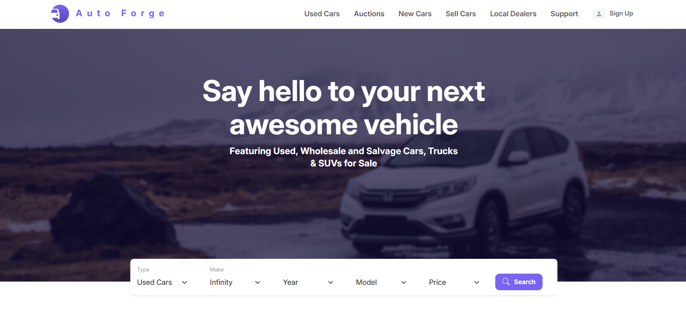
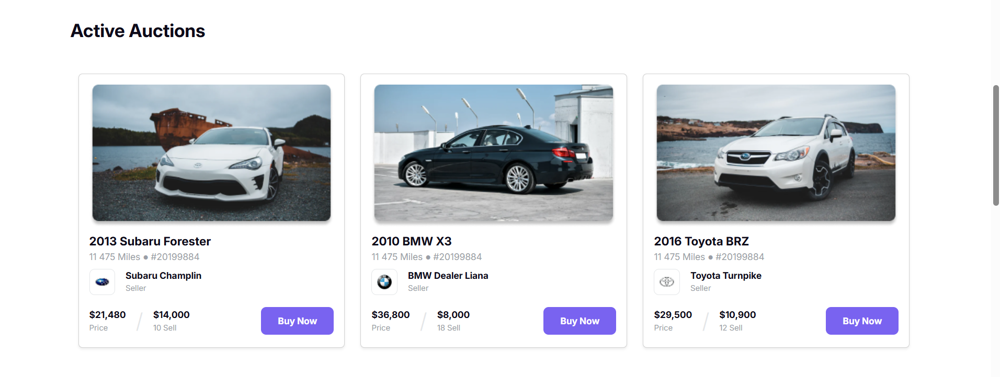
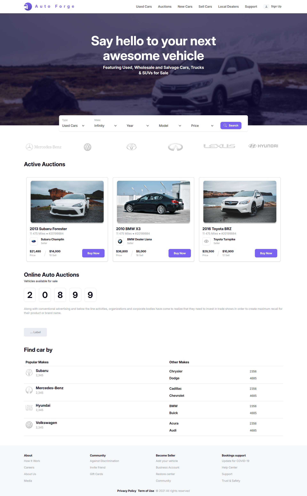

# 🚗 Auto Forge – Car Auction Landing Page

**Auto Forge** is a responsive landing page for a car auction platform where users can explore and buy cars. This landing page is crafted using **HTML**, **Bootstrap**, and **custom CSS**, offering a modern, responsive experience across all devices.

[🔗 Live Demo](https://devo-ab.github.io/auto-forge)

---

## ✨ Features

- ✅ Fully responsive design for mobile, tablet, and desktop
- 🚘 Car listings and auction details
- 🖼️ Banner section with a strong call to action
- 📦 Organized layout using Bootstrap grid
- 🎨 Custom CSS for refined styling
- 👣 Stylish footer

---

## 💻 Built With

- **HTML5**
- **Bootstrap 5**
- **Custom CSS**

---

## 📁 Folder Structure

```
auto-forge/
├── assets/
│   ├── banner/             # Banner section images
│   ├── icon/               # Website icons
│   ├── images/             # Car and layout images
│   └── logo/               # Brand logos
├── css/                    # Custom CSS files
├── preview/                # Screenshots for README
├── index.html              # Main HTML file
└── README.md               # Project documentation

```

---

## 🖼️ Screenshots

### 🧭 Hero Section & Navbar



### 🚘 Car Auctions



### Full Page Preview



---

## 🚀 How to Use Locally

1. **Clone the repository**
   ```bash
   git clone https://github.com/devo-ab/auto-forge.git
   ```

# 👤 Author

# Avi Jit

## :mailbox: Reach me out

<p align="left">
<a href="https://linkedin.com/in/itsavijitb" target="blank"></a>
<a href="https://twitter.com/itsavijitb" target="blank"></a>
<a href="https://facebook.com/itsavijitb" target="blank"></a>
<a href="https://instagram.com/itsavijitb" target="blank"></a>
</p>
